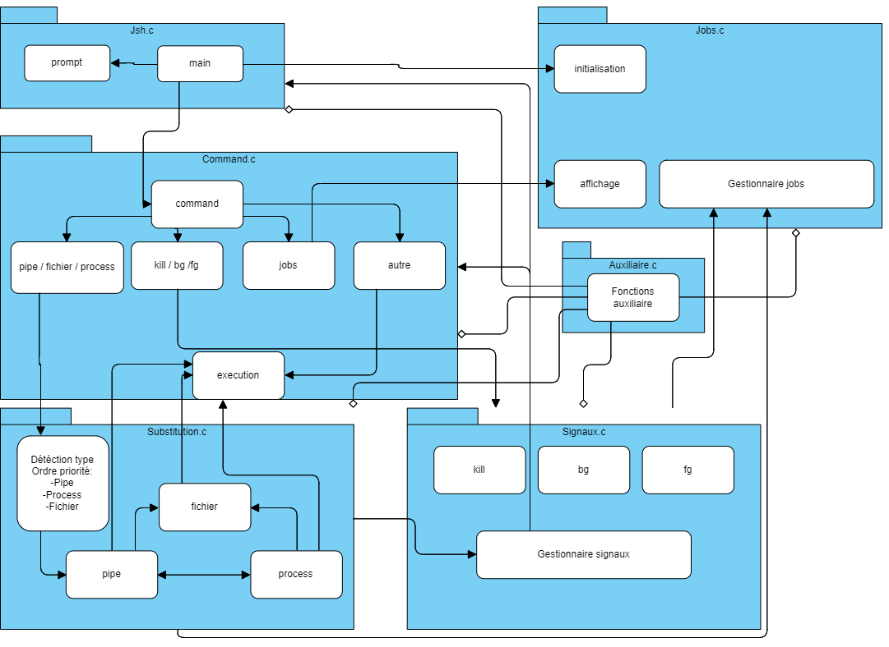

# Projet : programmation d'un interpréteur de commandes
Notre interpréteur de commandes ou shell personnalisé est composé de 6 fichiers interconnectés qui forme un ensemble de d'élément nécessaire à son bon fonctionnement.

L'architecture globale de notre shell est présentée dans ce diagramme.

**Remarque** : les flèches avec un triangle rempli indiquent l'utilisation à un moment précis du parcours du programme, la fonction ou le groupe de fonction pointé par la flèche, tandis que les flèches avec un losange vide indiquent une fonction ou groupe de fonction mise à disposition à tout moment pour les autres.

## Fonction principal

La fonction `main()` fait office de point de départ et point de terminaison du programme.

Dans un premier temps, `main` redirige la sortie du programme sur la sortie erreur, il initialise le contrôleur des jobs et le gestionnaire des signaux.

Ensuite, `main` lance une boucle infini dans laquelle il initie le prompt et la lecture de la commande et tout cela jusqu'à terminaison explicite du programme (crash forcé ou terminaison normal, exit).

Enfin, il transfert la commande écrite dans le terminal vers le gestionnaire des commandes qui va faire le nécessaire pour l’exécuter, et à la fin de celui-ci, il appelle le gestionnaire des jobs pour une actualisation et rajoute la commande dans l'historique du terminal.

## Gestionnaire de commande (cœur du programme)

Cette partie est en charge de tout les commandes qu'on lui transmet, il se traduit en 3 étapes:
* Filtrage
* Execution
* Actualisation de la valeur de retour

### Filtrage de la commande

Il a une liste de commande déjà préétabli auquel notre commande vient se comparer.
Nous avons deux cas possible:
* Soit c'est une commande que nous avons créé ou adapté et il exécute avec cell-ci.
* Sinon on le transfert vers une exécution directe par le système. 

### Execution 

Nous avons deux programmes pour l'exécution, une exécution indirect dans le cas où la commande ne correspond à aucune du filtrage, donc on appelle à la prise en charge des jobs et des signaux, puis on laisse un fils l'exécuter.

Et l'autre, une exécution direct dont l'exécuteur de la commande est le processus actuel, il est utilisé par une fonction présente dans le filtrage.

### Actualisation de la valeur de retour

Chaque exécution d'une commande que ce soit dans le filtrage ou hors, il renverra une valeur qui indiquera si son exécution s'est bien déroulé ou pas.
Depuis le terminal, la commande `?` permet de le récupérer.

## Gestionnaire de redirection

Dans le cas où le filtrage indique que la commande passée contient une redirection, c'est lui qui le prendra en charge. Le programme a par défaut un ordre de priorité:
* Redirection Pipe " | "
* Substitution de processus " <( ) "
* Redirection Fichier " < ; > ; ..."

Cette priorité permet le découpage sous forme d'arbre binaire ou dans le cas du code, permettre une certaine récursivité.

On exécute les différentes commandes obtenues par le découpage de la première commande en suivant cette priorité, de gauche vers la droite dans la lecture des feuilles de l'arbre, sauf dans le cas d'une substitution où c'est l'inverse, de la droite vers la gauche.

Le fonctionnement du code est assez semblable pour chacun, on découpe chaque morceau de la commande jusqu'à qu'il n'y ait plus rien à découper, sur son niveau précédent (ou nœud père dans l'idée de l'arbre binaire), on initialise la redirection voulue et on exécute la commande avec l'execution direct citée précédemment.

## Gestionnaire de signaux
### Fonctions signaux du filtrage

Cette partie ne contient que trois fonctions à exécution de commandes, càd disponible dans le filtrage:
* `kill`
* `bg`
* `fg`

Ils fonctionnent comme les commandes qu'on appelle dans un terminal standard sous linux mais sans passer par les appels des fonctions systèmes.

### Fonctions signaux passives

Ce qu'on appelle par signaux passives, ce sont des fonctions qui n'exécute pas des commandes mais change l'interaction du processus concerné par rapports à certains signaux recherchés.
Par exemple si l'on souhaite ignorer le signal `SIGTTIN`, ou réinitialiser toutes les interactions avec tous les signaux, etc.

## Gestionnaire de jobs

Le gestionnaire de job est une structure contenant une liste qui suit le premier et dernier job, c'est une structure de liste de liste. Le job est une structure contenant son pid, son pid de groupe, son état, la commande qui a été lancé avec ce processus, le job suivant et dans le cas s'il en a, ses sous job.

Ce gestionnaire effectue principalement 2 tâches, le suivi et l'affichage. Les jobs sont ajoutés si seulement si ils ont été lancé en arrière plan ou bien lorsqu'ils ont été interrompu au moment de leur exécution dans commandes ou redirection.

Le suivi s'effectue au moment de l'appel du processus (le premier `waitpid`), puis à chaque tour de boucle dans main, ou bien lors de l'appel à la commandes `jobs` ou `fd`.

## Fonctions auxiliaires

Cette partie est un regroupement de fonctions auxiliaires accessibles par tous, il aide principalement à l'éclaircissement du code.

